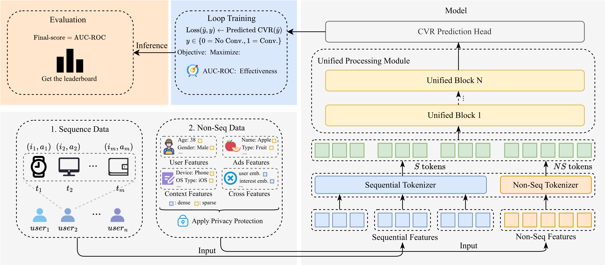
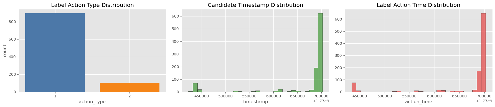
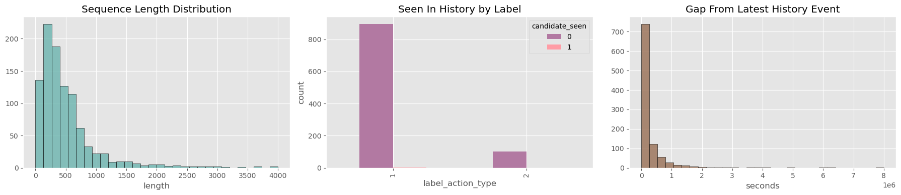
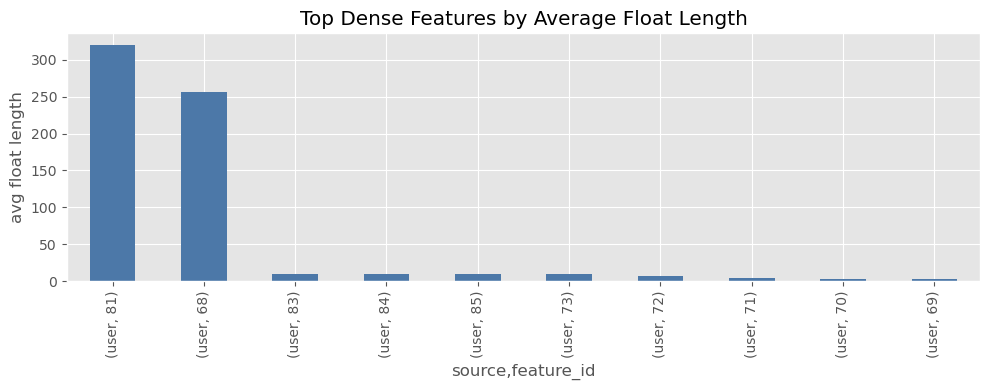
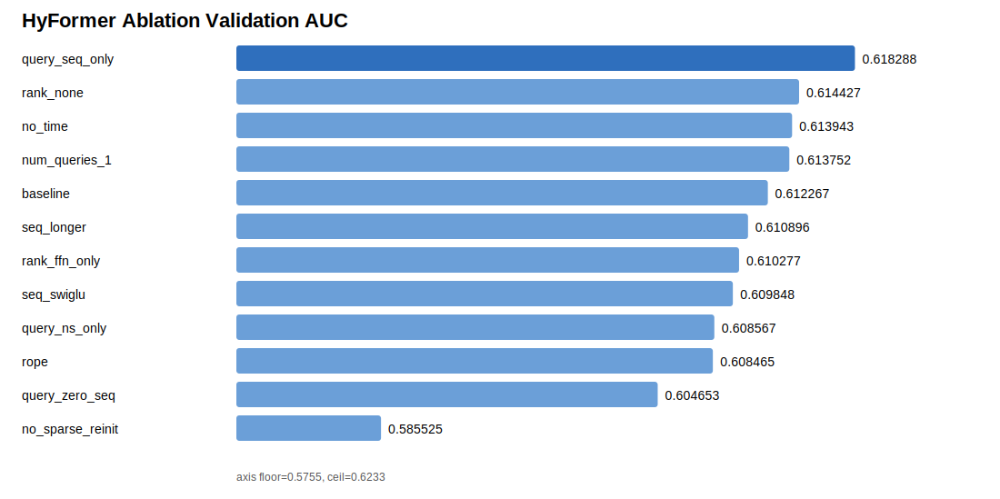

# TAAC KDD Cup 2026 

This repository presents our research and engineering efforts for the TAAC KDD Cup 2026 CTR Prediction Track, including scalable CTR modeling architectures, experimental pipelines, and post-competition analyses.

## Team

<table>
<tr>

<td align="center">
<a href="https://github.com/hun9008">

 
<b>Yonghun Jeong</b>
</a>
 
MS/Ph.D. Student
</td>

<td align="center">
<a href="https://github.com/archivehee">

 
<b>Daehee Kang </b>
</a>
 
MS/Ph.D. Student
</td>

<td align="center">
<a href="https://github.com/minssay">

 
<b>Minseong Seo </b>
</a>
 
MS/Ph.D. Student
</td>

</tr>
</table>

## Repositories

| Repository | Description |
| --- | --- |
| [`KDD_submission`](https://github.com/KDDcup26DIL/KDD_submission) | Main experiment repository used for the competition. The codebase was reorganized and adapted to comply with the official submission format of the TAAC KDD Cup 2026. |
| [`FuxiCTR`](https://github.com/KDDcup26DIL/FuxiCTR) | Repository for CTR prediction experiments based on the FuxiCTR framework, including model implementation, training, and evaluation pipelines. |
## Motivation
Recommendation research has progressed along two major branches:
1. Feature Interaction Models - focus on modeling high-dimensional multi-field categorical and contextual features.
2. Sequential Models - capture the temporal dynamcis of user behavior through embedding-based retrieval systems and Transformer-style ranking models.

Separated model progress limits → shallow corss-paradigm interaction, inconsistent optimization obejctives, limited scalability, and increasing hardware and engineering compelxity.

Solution: **"Towards Unifying Sequence Modeling and Feature Interaction for Large-scale Recommendaiton"**

## Progress

### CTR Prediction Baselines
| Model Name | Description |
| --- | --- |
| [`HyFormer`](https://arxiv.org/pdf/2601.12681) | Query Decoding module that expands non-sequential features into global tokens to decode long behavioral sequences layer-by-layer, then alternates this with a Query Boosting module to explicitly mix and enrich these tokens through lightweight feature interaction across stacked layers. |

### Previous Competition Analysis

| Competition | References | Transferable Insight |
| --- | --- | --- |
| WSDM Cup 2023 | [`Feature-Enhanced Network`](../assets/Feature-Enhanced%20Network%20with%20Hybrid%20Debiasing%20Strategies%20for%20Unbiased%20Learning%20to%20Rank.pdf), [`THUIR`](../assets/THUIR%20at%20WSDM%20Cup%202023%20Task%201-%20Unbiased%20Learning%20to%20Rank.pdf) | Top solutions combined heterogeneous signals: neural rankers, debiasing, feature engineering, IR features, and tree-based models. |
| Toss CTR Prediction | [6th-place review](https://dacon.io/en/competitions/official/236575/talkboard/415425?page=1&dtype=recent), private 1st-place review | Winning solutions relied on strong tabular preprocessing and large ensembles of small or classical models. |

| Key Lesson | Impact on Our Approach |
| --- | --- |
| Ensembles were repeatedly effective in prior competitions. | Direct ensembling was excluded because KDD Cup rules prohibit it. |
| Diverse feature views still mattered. | Motivated an N-tower direction: one deployable model with internally separated feature views. |
| Anonymous features require statistical treatment. | Prioritized frequency, missingness, cardinality, and distribution-based preprocessing. |
| Simple ML baselines can be highly competitive. | Used FinalMLP as a practical baseline and kept fast ML checks as a parallel option. |
| Since anonymous features are ambiguous, all features has not valuable info. | Developed as hyformer_tref, trimmed query |

### Dataset Analysis

We analyzed 1,000 samples from `train_0.parquet` to understand the dataset structure and identify basic modeling signals. The data consists of `user_id`, `item_id`, `label`, `timestamp`, `user_feature`, `item_feature`, and `seq_feature`. The label distribution is imbalanced, with 897 samples for action type 1 and 103 samples for action type 2. All 1,000 users are unique, while 927 unique items appear in the sample, indicating partial item repetition.

The nested schema shows that `user_feature`, `item_feature`, and `seq_feature` are all represented through anonymized feature ids. In particular, `seq_feature` is divided into `action_seq`, `content_seq`, and `item_seq` blocks. The sequence length varies substantially, with a mean of 510.9, a median of 364.5, and a maximum of 3,999. The candidate item appears in the user's historical sequence only once out of 1,000 samples, suggesting that simple item re-appearance is unlikely to be a strong standalone signal.

We also examined whether timestamps could be used to separate long-term and short-term sequences. However, because the sample spans only about 13 days, we considered timestamp-based long/short-term splitting to be inappropriate.

Although the task is CTR prediction, it can also be interpreted from a recommender-system perspective: `user_id`, `item_id`, and click/action labels define user-item interactions. This suggests that user/item embedding-based interaction modeling is worth exploring alongside standard CTR feature interaction models.

Because the data columns and feature ids are anonymized, direct semantic interpretation is difficult. Instead of relying on domain-knowledge-driven feature engineering, a more realistic approach is to use statistical properties such as feature type, presence frequency, sequence length, and missing patterns.

Since many features are sequence-based and their lengths vary widely, modeling only sparse feature interactions may be insufficient. Sequence modeling should therefore be considered as an important component of the CTR prediction pipeline.

### Research

**Research Goal.** Build a single-model CTR ranker that unifies feature interaction and multi-domain sequence modeling under the KDD Cup no-ensemble constraint.

| Setup | Summary |
| --- | --- |
| Framework | Built a submission-compatible experiment pipeline with model-scoped `*_local` and `*_submission` folders, `run.local.sh` for train/valid/test evaluation, and `run.submit.sh` for official package generation. |
| Local datasets | Evaluated baselines and variants on Toss Tiny, Frappe, Criteo, Avazu, and KDD Sample before selecting models for submission. |
| Logging | Stored each run with aligned `log/`, `checkpoint/`, and `local_runs/` artifacts to trace metrics, failures, and selected checkpoints. |

| Model | Submission AUC | Role | Summary |
| --- | ---: | --- | --- |
| `HyFormer UniMixer` | **0.817867** | Best | Tokenization + HyFormer internal mixing gave the strongest result. |
| `HyFormer UniMixer token only` | **0.817618** | Strong variant | Tokenizer-level change transferred well without heavy block modification. |
| `HyFormer tref` | **0.817137** | Main HyFormer improvement | Stable query construction from user/item/sequence summaries improved the base model. |
| `HyFormer` | 0.813109 | Base | Strong sequence-aware baseline after 10 epochs. |
| `HyFormer wo meanpool(seq)` | 0.804653 | Ablation | Removing sequence summary degraded performance. |
| `HyFormer WuKong fusion` | 0.800326 | N-tower trial | Large auxiliary fusion failed to improve over the base. |
| `DCNv2` / `Wukong` | 0.790978 / 0.791163 | Fast baselines | Useful early checks, but below HyFormer-family models. |
| `LightGCN` / `user init` | 0.627606 / 0.619317 | Failed priors | Label-derived graph or click-history shortcuts did not transfer. |

| Axis | Main Result | Decision |
| --- | --- | --- |
| Backbone | `HyFormer` reached **0.813109** and all top variants were HyFormer-based. | Use HyFormer as the main backbone. |
| Query design | `HyFormer tref` improved HyFormer from **0.813109 → 0.817137**. | Keep stable `F_u`, `F_i`, and `MeanPool(Seq_i)` query construction. |
| Tokenization | UniMixer token-only reached **0.817618**. | Prefer tokenizer-level changes over heavy block changes. |
| Sequence signal | Removing `MeanPool(seq)` dropped to **0.804653**. | Preserve simple sequence summaries. |
| Sparse regularization | `no_sparse_reinit` was the weakest ablation, **0.585525** AUC. | Keep high-cardinality embedding re-initialization. |

| Tried Direction | Outcome | Lesson |
| --- | --- | --- |
| DCNv2 / Wukong baselines | Fast and useful, around **0.791** at 1 epoch. | Good sanity checks, not final best. |
| WuKong / DCNv2 auxiliary fusion | Stayed around **0.799-0.800** submission AUC. | Large N-tower fusion introduced noise. |
| LightGCN / user-click init | Dropped to **0.627606 / 0.619317**. | Avoid label-derived graph or user-history shortcuts. |
| RankUp / TokenFormer / LoopCTR ideas | Mixed results as full variants. | Use them only as small internal modifications. |

**Key Takeaway.** The best gains came from compact HyFormer-internal changes, not from adding larger external towers.

For full experimental logs, model-family analysis, and failure cases, see [research_detail.md](research_detail.md).

## Reviews
1. Based on Toss 2025 competition, and KDD cup 2026 result, there might be the influence of seed number.

## Conclusion

## Reference

| Paper | Conference | Topic |
| --- | --- | --- |
| [`Distribution-Aware End-to-End Embedding for Streaming Numerical Features in Click-Through Rate Prediction`](https://doi.org/10.1145/3746252.3761565) | preprint | Numerical feature embedding, Streaming training, Sample-based distribution estimation, Quantile space interpolation, Field-wise modulation |
| [`EulerNet: Adaptive Feature Interaction Learning via Euler's Formula for CTR Prediction`](https://doi.org/10.1145/3539618.3591681) | SIGIR(2023) | Euler's formula, Complex vector space, Phase and amplitude modulation, Adaptive high-order combination, Unified architecture |
| [`Feature-Enhanced Network with Hybrid Debiasing Strategies for Unbiased Learning to Rank`](../assets/Feature-Enhanced%20Network%20with%20Hybrid%20Debiasing%20Strategies%20for%20Unbiased%20Learning%20to%20Rank.pdf) | WSDM Cup(2023) | Feature-enhanced ranking network, Hybrid debiasing, Label adjustment, Feature engineering, Unbiased learning to rank |
| [`FINAL: Factorized Interaction Layer for CTR Prediction`](https://doi.org/10.1145/3539618.3591988) | SIGIR(2023) | Factorized interaction layer, Fast exponentiation algorithm, Hierarchical interaction expansion, Multi-block knowledge exchange, Knowledge distillation |
| [`FinalMLP: An Enhanced Two-Stream MLP Model for CTR Prediction`](https://arxiv.org/abs/2304.00902) | AAAI(2024) | Two-stream MLP architecture, Feature gating, Interaction aggregation, Differentiated feature inputs, Stream-level fusion |
| [`FiBiNET: Combining Feature Importance and Bilinear Feature Interaction for Click-Through Rate Prediction`](https://arxiv.org/abs/1905.09433) | preprint | SENET feature importance, Bilinear feature interaction, Shallow and deep CTR modeling, Field-wise interaction learning |
| [`GDCN: Towards Deeper, Lighter and Interpretable Cross Network for CTR Prediction`](https://arxiv.org/abs/2311.04635) | preprint | Gated cross network, Explicit high-order feature interaction, Field-level dimension optimization, Interpretable CTR prediction |
| [`HyFormer: Revisiting the Roles of Sequence Modeling and Feature Interaction in CTR Prediction`](https://arxiv.org/pdf/2601.12681) | preprint | Global token interface, Behavior sequence decoding, Token mixture boosting, Multi-sequence independent modeling, Bidirectional information flow |
| [`InterFormer: Towards Effective Heterogeneous Interaction Learning for Click-Through Rate Prediction`](https://arxiv.org/abs/2411.09852) | preprint | Heterogeneous interaction learning, Bidirectional cross-mode information flow, User profile and behavior sequence fusion, Bridge-based summarization |
| [`LoopCTR: Unlocking the Loop Scaling Power for Click-Through Rate Prediction`](https://arxiv.org/abs/2604.19550) | preprint | Loop-based CTR scaling, Repeated feature interaction refinement, Parameter-efficient scaling, Industrial CTR prediction |
| [`OneTrans: Unified Feature Interaction and Sequence Modeling with One Transformer in Industrial Recommender`](https://arxiv.org/abs/2510.26104) | preprint | Unified tokenizer, Causal attention mask, Cross-request KV caching, Single Transformer backbone, Mixed-parameterization setting |
| [`RankUp: Towards High-rank Representations for Large Scale Advertising Recommender Systems`](https://arxiv.org/abs/2604.17878) | preprint | High-rank representation learning, Dimensional collapse mitigation, Large-scale advertising recommendation, Rank-aware embedding |
| [`SG-URInit: Well Begun is Half Done: Training-Free and Model-Agnostic Semantically Guaranteed User Representation Initialization for Multimodal Recommendation`](https://arxiv.org/abs/2604.14839) | preprint | Training-free user representation initialization, Model-agnostic initialization, Multimodal recommendation, Semantic guarantee |
| [`THUIR at WSDM Cup 2023 Task 1: Unbiased Learning to Rank`](../assets/THUIR%20at%20WSDM%20Cup%202023%20Task%201-%20Unbiased%20Learning%20to%20Rank.pdf) | WSDM Cup(2023) | Unbiased learning to rank, Pretrained Transformer, Traditional IR features, Learning-to-rank features, Tree-based models |
| [`TokenFormer: Unify the Multi-Field and Sequential Recommendation Worlds`](https://arxiv.org/abs/2604.13737) | preprint | Unified multi-field and sequential recommendation, BFTS attention, Non-linear interaction representation, Dimensional robustness |
| [`Towards Universal Sequence Representation Learning for Recommender Systems`](https://doi.org/10.1145/3534678.3539381) | KDD(2022) | UniSRec, Text-based encoding, Parameter whitening transform, Mixture-of-Experts adapter, Multi-domain contrastive learning |
| [`Streamlining Feature Interactions via Selectively Crossing Vectors for Click-Through Rate Prediction`](https://doi.org/10.1145/3746252.3761193) | CIKM(2025) | Selectively crossing vectors, Global sparse interaction graph, Multi-stage expert learning, Inter-intra stream fusion, Label bias distillation |
| [`TurboQuant: Online Vector Quantization with Near-optimal Distortion Rate`](https://arxiv.org/abs/2504.19874) | preprint | Online vector quantization, Embedding/KV-cache compression, Random rotation, Scalar quantization, Inner-product estimation |
| [`Towards Unifying Feature Interaction Models for Click-Through Rate Prediction`](https://arxiv.org/abs/2411.12441) | preprint | IPA framework, Interaction function typification, Layer pooling method, Layer-wise weight combiner, Dimension collapse mitigation |
| [`UniMixer: A Unified Architecture for Scaling Laws in Recommendation Systems`](https://arxiv.org/abs/2604.00590) | preprint | Unified recommendation architecture, Scaling law analysis, Feature interaction and sequence modeling, Industrial recommendation systems |
| [`Wide & Deep Learning for Recommender Systems`](https://arxiv.org/abs/1606.07792) | DLRS(2016) | Memorization and generalization, Wide linear model, Deep neural network, Sparse feature embeddings, Production recommender systems |
| [`Wukong: Towards a Scaling Law for Large-Scale Recommendation`](https://arxiv.org/abs/2403.02545) | preprint | Power-law based FM stacking, Linear compression block, Dense scaling law expansion, Low-rank computation optimization, Pyramidal structure |
| ['MMQ: Multimodal Mixture-of-antization Tokenization for Semantic ID Generation and User Behavioral Adaptation'](https://dl.acm.org/doi/10.1145/3773966.3777923) | WSDM(2026) | Codebook utilization, Semantic ID, Vector quantization, Item alignment |
